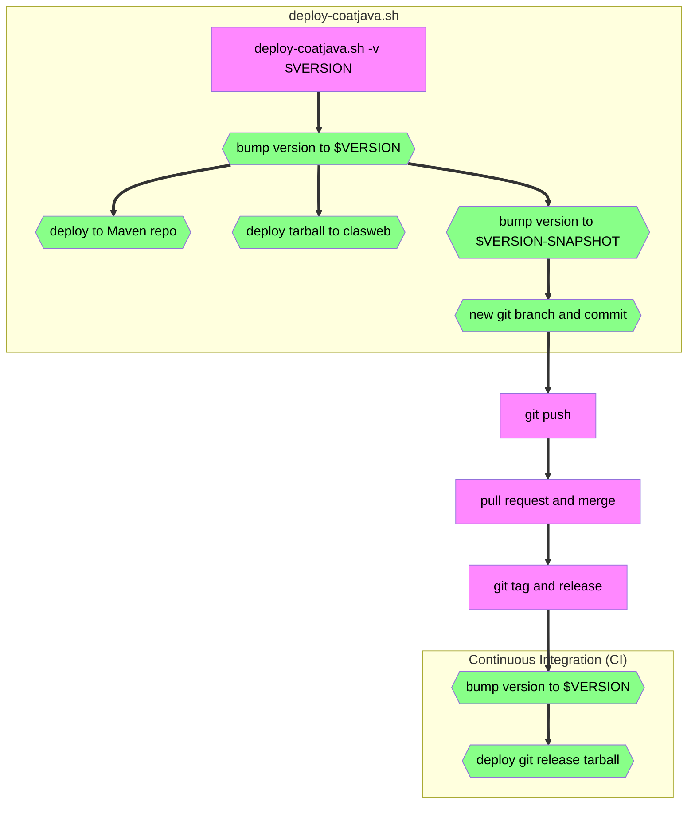
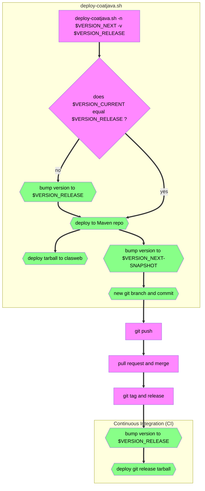

# Developer Notes

## Controlling Log Levels

To control the log level of a class with a `Logger`, make a logging `.properties` file, and set the level of each of your classes for which you want to use a non-default level; use the property name `className.level`, for example:
```
# my_levels.properties
org.jlab.detector.helicity.HelicityGenerator.level = FINEST
org.jlab.detector.calib.utils.RCDBProvider.level = FINER
```
You can also control the _global_ log level for all classes with `.level`, for example, to set
it to `FINE`:
```
.level = FINE
```
To use this `.properties` file, run with the `java` option
```
-Djava.util.logging.config.file=my_levels.properties
```
For example, if using `run-coatjava`,
```bash
run-coatjava [CLASS_NAME] [CLASS_ARGS] -- -Djava.util.logging.config.file=my_levels.properties
```
From high to low, the levels are `SEVERE, WARNING, INFO, CONFIG, FINE, FINER, FINEST` (see `java.util.logging.Level` documentation).
You may also use levels `ALL` or `OFF`, for everything or nothing, respectively.

> [!NOTE]
> These properties may compete with the log level set by `OptionParser`'s option `-l`, potentially overriding that level. For example, `postprocess` and `decoder` use `OptionParser`.

## Bumping Version Number and Deploying

Deploying a new version requires a new version number, named `$VERSION` in this
document.
- the release build will have version `$VERSION`
- the `git` repository will have version `${VERSION}-SNAPSHOT`
  - note that this is **not** conventional, since typically `-SNAPSHOT` is used for _upcoming_ releases

### General Procedure
1. be on a machine from which you have permission to deploy (see `deploy-coatjava.sh`'s `scp` commands)
1. `git switch development && git pull`
1. make sure you have no local changes (`git status`)
1. `./deploy-coatjava.sh -v $VERSION`
1. `git push` -> open PR -> review PR -> merge
1. make `git` tag and release

> [!NOTE]
> Should `deploy-coatjava.sh` fail midway, your `git` repository may no longer be in the recommended initial state; here's how to revert:
> 1. `git switch development` to switch back to `development` branch
> 1. `libexec/version-bump.sh $ORIGINAL_VERSION` and be sure to include the `-SNAPSHOT`; alternatively, `git reset --hard`
> 1. `git branch -D version/$VERSION` to delete the created version-bump branch

**Legend:**
- magenta rectangle: manual step
- green hexagon: automated



<!-- FIXME: this is the "correct" approach

Deploying a new version requires a current version number, named `$VERSION_RELEASE`,
and a new version number for the future release, named `$VERSION_NEXT`
- by default, `$VERSION_RELEASE` is `$VERSION_CURRENT`, the current project version
  - it can be changed if needed
- the git repository will then have version `${VERSION_NEXT}-SNAPSHOT`
  - by the time we are ready to release version `$VERSION_NEXT`, we
    may need to change the version number again, depending on whether we change
    the MAJOR, MINOR, or PATCH number
  - by default, `$VERSION_NEXT` can initially be `$VERSION_CURRENT` with the PATCH number
    incremented by 1, since most of our releases are PATCH releases
- this is the "conventional" approach, and Maven can automate these version bumps,
  but we just use the script since it does a bit more

**Legend:**
- magenta rectangle: manual step
- green hexagon: automated


-->
