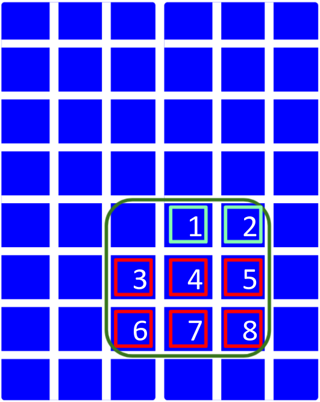
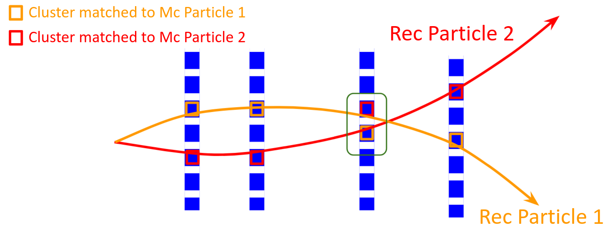
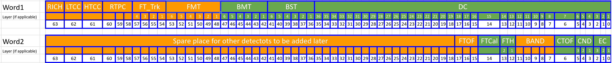

# 
 Truth Matching 

# Read this 1^st^
In order the Truth Matching to work, it is important to invoke specific options when one runs GEMC:
* -SAVE_ALL_MOTHERS=1  
* -SKIPREJECTEDHITS=1
* -INTEGRATEDRAW="*"
* -NGENP=50 // This is not necessarily needed, if you are sure in LUND file the number of generated particles is always smaller than 10, you can skip this option

If you are not interested how the matching works, but just want to us it as a black-box, then please run GEMC with above mentioned options,
Below is an example command that will allow the TrutMatching service to work properly.

     gemc det.gcard -SAVE_ALL_MOTHERS=1 -SKIPREJECTEDHITS=1 -NGENP=50 -INTEGRATEDRAW="*" -N=10000 -USE_GUI=0 -INPUT_GEN_FILE="lund, inp_Lund.dat" -RUNNO=11 -OUTPUT="hipo, GEMC_Out.hipo"

# Introduction
In Monte Carlo (MC) simulations very frequently there is a need to know links between the generated 
particle and the reconstructed particle. Users usually compare kinematics (momentum and the angle) of 
the generated and reconstructed particles in order to determine if the reconstructed particle is the one 
corresponding to the given MC particle. In particular, user requires the difference/ratio of angles/momenta 
between reconstructed and MC particles to be within certain limits. Depending on the need of the study, 
this might be sufficient, however there are also cases when this approach is not enough. In particular when 
the number of generated and reconstructed particles are more than 1-2, one can get significant amount
of non-unique matches. Another downside of this type of matching is that user will always loose some
real corresponding particles, as because of multiple scattering and radiation, these distributions (difference
between MC and reconstructed kinematic variables) have tails extending beyond user specified cuts. 
The service **'TruthMatch'** in COATJAVA makes links
between MC and reconstructed particles in a more rigorous way by checking MC and reconstructed hits of
particles from almost all detectors and determining which MC and Recon particle the hit correspond to.

# The matching algorithm

## What kind of information the matching provides
The service provides two types (one can call directions too) of matching: \
In the 1^st^ type, for each MC::Particle, it points to the entry in the REC::Particle bank, which it thinks is the
**best match** for the given MC particle in the MC::Particle bank.\
The 2nd type, does the opposite, for each reconstructed particle in the REC::Particle bank it points to the
entry in the MC::Particle bank that is the **best matched** to the given reconstructed particle.\
The service provides also additional **status words** which encode information about what type of detectors (layers of detectors) participated
in the matching of the given particle. \
Then finally it provides a variable **quality**, which characterizes the reliability of the matching, i.e. 
higher the quality higher is the contribution of matched MC particle (or Rec Particle in the other type of matching) to the
given Rec Particle. 

## How the matching is done.

I would like to start with a very simple example that will help to understand better the
underlying principle of the truth matching. Suppose we have generated an
event with several particles inside the CLAS12 acceptance, then this
event is passed through the GEMC, and then reconstructed with
COATJAVA. Now let say we pick up a random MC hit in the
ECal (the general concept is valid for almost all detectors), and
want to know the initial MC particle that generated the hit, and also want to know
the reconstructed particle that the given hit belongs to. \
All MC hits are stored in the "MC::True" bank. The variable **otid**
shows the index of the original particle that generated the given hit.
So the first part was quite simple we just need to pick the otid-th
particle in? the "MC::Particle" bank. Now for the 2nd step, which is to
find the recon particle that the given hit belongs to, we will use
another variable **hitn**, which shows the index of the given hit in the
ADC/TDC bank of the corresponding detector. The path from the ADC bank
to the "REC::Particle" is done through 3 to 4 intermediate banks (the
number of intermediate banks depends on the given detector), however it
is straightforward. First step is to look into "ECAL::hits" bank and
from it pick the hit that has the variable **id** (for some other
detector banks this variable name can differ e.g. **hitID**, **ID**). In
the "ECAL::hits" bank the variable **clusterId** (which also can have
different names in different detectors) will point to the index of the
cluster in the "ECAL::clusters" bank that the given hit belongs to. Then
we should look the "REC::Calorimeter" bank, and chose the row that has
the variable **index** equal to the **clusterId**. Finally the variable
**pindex** in the "REC::Calorimeter" bank will point to the index of the
reconstructed particle in the "REC::Particle" bank. So in this example
picking a random hit we can relate the MC particle to the recon
particle. In reality however the MC particle can leave in the CLAS12
detector hundreds of hits, and not all MC hits of the given MC particle necessarily 
will point to the same recon particle, and wise versa not all ADC/TDC
hits of the given recon particle will necessarily be generated from the same MC
particle.

From the example above, it is obvious that a single cluster (if it
applies for a given detector) can contain hits originated from more than
one MC particles.

*An example cluster containing hits from two different MC particles.
Numbers in represent the hitID of the hit in the cluster. Hits in cyan
color were originated from one MC particle, and hits in red are
originated from another MC
particle.*

The figure above shows an example of the cluster with 8
hits, 2 of them are from one MC particle, let's call it mcp1, and the
other 6 are from another MC particle let's call it mcp2. The truth
matching will associate the given cluster to the MCParticle that has the
most number of hits in it. In particular for the given example the
cluster will be matched to the mcp2. This example of the cluster was an
abstract example which doesn't relate to any specific CLAS12 detector,
however the algorithm is applicable to all CLAS12 detectors, the cluster
will be matched to the MC Particle that has the highest number of hits
in it. With this rule all clusters from all detectors that participate in the truth matching, are collected and the MC Particle is
identified for each of them.

Now as we already defined the algorithm how to match MC Particle to the
Recon cluster, we can think how to match MC Particle to the Recon
Particle. As the cluster is an object consisting of hits, we can think
of a Recon Particle as an object consisting of clusters which are
related to the Recon particle through the response banks
(e.g. REC::Calorimeter, REC::Scintillator etc). As in the case of the
cluster, it is not necessarily true that all hits of the cluster will be
originated from the same MC Particle, here again, all recon clusters
matched to a given MC Particle will not necessarily be part of the given
Recon particle, and wise versa, not all clusters of the given recon
particle will necessarily be originated from the given MC Particle.

*An example illustrating a case when two clusters matched to two MC
particles end up in opposite Rec Particles. Cluster marked by red
(orange) rectangle inside the green area, is matched to the MC Particle
1(2), however Event Builder associated it the the Rec Particle
2(1).*

An abstract example is shown in the figure above, when not all recon clusters matched
to the given MC Particle are matched to the same recon particle. The
Truth Matching service in such cases chose the recon particle that has
the highest number of matched clusters to the given MC particle.

# Bank structures

The TruthMatch service produces two banks **MC::GenMatch** and **MC::RecMatch**.

## **MC::GenMatch**
Lets start from the **MC::GenMatch** bank.
The number of entries (columns) in the **MC::GenMatch** is equal to the number of entries in the **MC::Particle** bank.
Below is the snippet from the json file describing the **MC::GenMatch** structure.

        "name": "MC::GenMatch",
        "group": 40,
        "item" : 6,
        "info": "MC::Particle -> REC::Particle matching",
        "entries": [
            {"name":"mcindex",       "type":"S",  "info":"MC::Particle index"},
            {"name":"pindex",        "type":"S",  "info":"REC::Particle index"},
            {"name":"mclayer1",      "type":"L",  "info":"layers from the 1st set of detectors hit by MC particle"},
            {"name":"mclayer2",      "type":"L",  "info":"layers from the 2nd set of detectors hit by MC particle"},
            {"name":"player1",       "type":"L",  "info":"layers from the 1st set of detectors hit by Recon particle"},
            {"name":"player2",       "type":"L",  "info":"layers from the 2nd set of detectors hit by Recon particle"},
            {"name":"quality",       "type":"F",  "info":"matching quality parameter"}

* The **mcindex** is the index of the MC Particle in the **MC::Particle** bank that we want to match to the Rec particle. \
* The **pindex** is the index of the matched REC particle in the **REC::Particle** bank. \
* **mclayer1** and **mclayer2**  are 64 bit LONGs, where each bit of those words indicates whether the the given MC particle
deposited hit in a specific detector/layer of CLAS12. See section [Status word description](#StatWordDescription)
for details on detector<=>bit correspondence.\
* **player1** and **player2** are again 64 bit LONG words, however their bits represent detector/layers of the matched Rec Particle,
 but only those layers which are matched to the given MC particle. In the **MC::GenMatch** bank, set bits of **player1(2)** is always
 subset of set bits of **mclayer1(2)**.

## **MC::RecMatch**
The structure of **MC::RecMatch** bank is very similar to **MC::GenMatch** and meanings of variables are
analogous to those from the **MC::GenMatch** bank..
The number of entries (columns) in the **MC::RecMatch** is equal to the number of entries in the **REC::Particle** bank.
Below is the snippet from the json file describing the **MC::RecMatch** structure.

        "name": "MC::RecMatch",
        "group": 40,
        "item" : 7,
        "info": "Rec::Particle -> MC::Particle matching",
        "entries": [
            {"name":"pindex",        "type":"S",  "info":"REC::Particle index"},
            {"name":"mcindex",       "type":"S",  "info":"MC::Particle index"},
            {"name":"player1",       "type":"L",  "info":"layers from the 1st set of detectors hit by Recon particle"},
            {"name":"player2",       "type":"L",  "info":"layers from the 1st set of detectors hit by Recon particle"},
            {"name":"mclayer1",      "type":"L",  "info":"layers from the 1st set of detectors hit by MC particle"},
            {"name":"mclayer2",      "type":"L",  "info":"layers from the 2nd set of detectors hit by MC particle"},
            {"name":"quality",       "type":"F",  "info":"matching quality parameter"}

* The **pindex** is the index of the particle in the **REC::Particle** bank that we want to match to MC particle \
* The **mcindex** is the index of the MC Particle in the **MC::Particle** that is matched to the pindext-th particle in the REC::Particle bank. \
* **player1** and **player2** as in the case of **MC::GenMatch** bank, are two 64 bit LONG words where each bit indicates
 presence of the hit of the given REC particle in specific detector bits.
* **mclayer1** and **mclayer2**  shows which detector/layers the matched MC particle has deposited hits, and here
 again those detector/layers are not all detectors/layers the matched MC particle has deposited hits, but only those which 
 are matched to the given Rec particle, in other words set bits of **mclayer1(2)** is always subset of set bits of **player1(2)**

### Status word description 
In [Bank Structures](#BANK_STRUCTURES) it is mentioned that in addition to the index of the matched particle,
bank provides also status words, which encode list of detector layers the given MC (or Rec) particle deposited hits into.
*Representation of status words. Fields in Orange are not implemented yet.*

The figure above describes the mapping between word/bitnumber and detector/layer. Detector acronyms should be
well known for anyone familiar with CLAS12 detector, except "FTH" which represents Forward tagger Hodoscope, and because
of space constrains is named "FTH".

In the figure below shown the decoding of an example status word.
*An example of a status word, showing that the given particle deposited hits in all DC layers except 15, 19, 20 and 29.
Then it deposited hits in first four layers of BST, and in BMT it hit layers 1, 2 and 6*

